<p align="center">
  
</p>
<p align="center"><sub>项目概念封面 · 经用户选定的插画；不是界面截图、真实模型输出或架构定义。模块关系以下方图解和源码为准。</sub></p>

<div align="center">

<h1>Local Agent</h1>

<p><strong>把本地模型，接入你的工作流。</strong></p>
<p>ncnn 双引擎 · 文档工作台 · 可审阅的工具调用 · 独立资源监控</p>

<p>
  <a href="https://github.com/chentyjpm/ncnn_llm-agent-demo/actions/workflows/ci.yml"></a>
  <a href="https://github.com/chentyjpm/ncnn_llm-agent-demo/actions/workflows/qwen05-cpu.yml"></a>
  <a href="https://github.com/chentyjpm/ncnn_llm-agent-demo/actions/workflows/native-monitor.yml"></a>
  <a href="https://github.com/chentyjpm/ncnn_llm-agent-demo/actions/workflows/installers.yml"></a>
</p>

<p>
  <a href="docs/INSTALLATION.md"><strong>安装与升级</strong></a> ·
  <a href="#screenshots">运行画面</a> ·
  <a href="#visual-guide">图解项目</a> ·
  <a href="#architecture">架构与模块</a> ·
  <a href="#quick-start">快速开始</a> ·
  <a href="docs/ARCHITECTURE.md">深入代码</a>
</p>

<sub>Local-first / Vulkan-preferred / CPU fallback / MIT</sub>

</div>

<br>

Local Agent 将 **本地文本模型、图像引擎、文件与 Office 工具**组合成一个桌面应用：在 H5 工作台里提出任务，在执行记录里审阅工具调用，在原生管理窗口里观察 CPU、内存和 GPU。

**引擎负责计算，Python 负责编排，工具负责执行，你保留操作控制权。** 安装版内置运行组件与两个引擎；模型权重按需下载，不必手工填写引擎路径。

<a id="screenshots"></a>

## 先看工作台

<picture>
  <source media="(prefers-color-scheme: dark)" srcset="docs/images/ui-home-dark.png">
  <source media="(prefers-color-scheme: light)" srcset="docs/images/ui-home-light.png">
  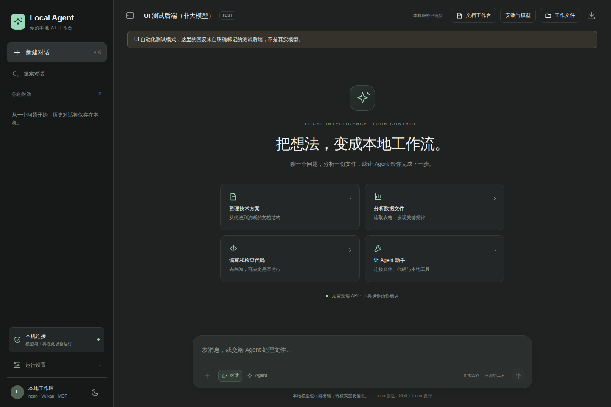
</picture>

<p align="center"><sub>实际 H5 浏览器截图。此组浏览器验收使用明确标注的模型测试替身，展示交互界面，不作为真实模型回答的证明。</sub></p>

<table>
<tr>
<td width="33%" valign="top"><strong>本地推理，双引擎组合</strong><br>文本与图像分别运行，默认优先可用的硬件 Vulkan；没有可用设备时选择 CPU。</td>
<td width="33%" valign="top"><strong>从回答到工作文件</strong><br>读取 Word、Excel、PPT 和 Markdown，编辑草稿，再导出可继续编辑的新文档。</td>
<td width="33%" valign="top"><strong>让工具调用可见</strong><br>查看动作、参数和结果；写文件、运行代码及其他有副作用的操作逐次确认。</td>
</tr>
<tr>
<td valign="top"><strong>按需安装模型</strong><br>选择 ModelScope 或 Hugging Face，查看大小、下载进度、校验、转换和启用状态。</td>
<td valign="top"><strong>独立后台管理</strong><br>浏览器之外的原生窗口，观察系统与本程序占用，暂停新任务、停止任务、导出诊断。</td>
<td valign="top"><strong>通过 MCP 扩展</strong><br>把明确授权的 stdio MCP 工具接入同一个 Registry，和内置文件、文档工具组合。</td>
</tr>
</table>

### 文档、模型和工具，在同一个工作台

<table>
<tr>
<td width="50%" valign="top">
<strong>01 / 文档工作台</strong><br>
<a href="docs/images/ui-documents.png">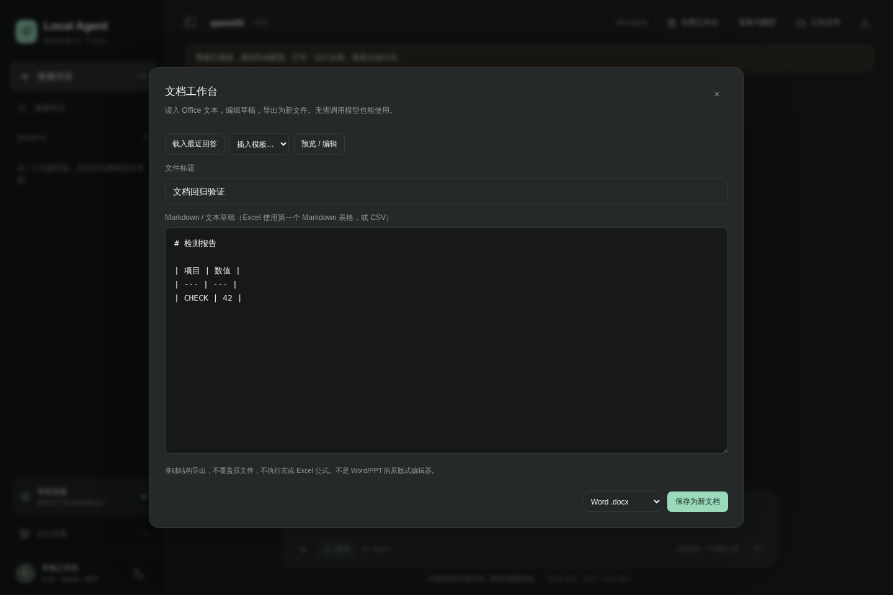</a><br>
<sub>编辑草稿、预览文本、导出 DOCX / XLSX / PPTX / MD。图中为合成测试文稿。</sub>
</td>
<td width="50%" valign="top">
<strong>02 / 下载源与模型选择</strong><br>
<a href="docs/images/model-center-sources.png">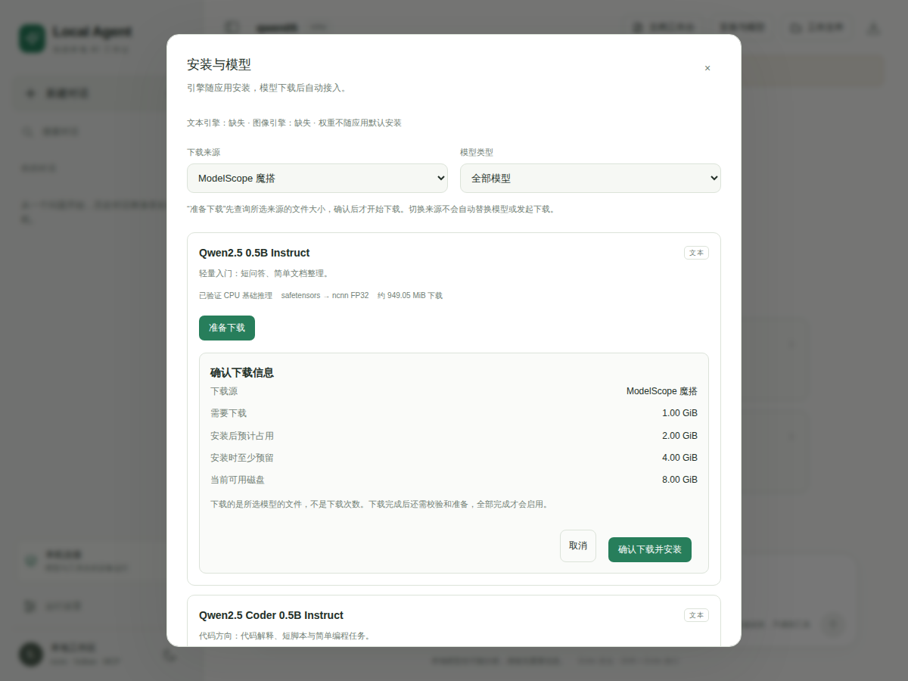</a><br>
<sub>先选择来源和模型，再确认下载。图中元数据为 UI 测试样本。</sub>
</td>
</tr>
<tr>
<td valign="top">
<strong>03 / 工具执行确认</strong><br>
<a href="docs/images/ui-approval.png">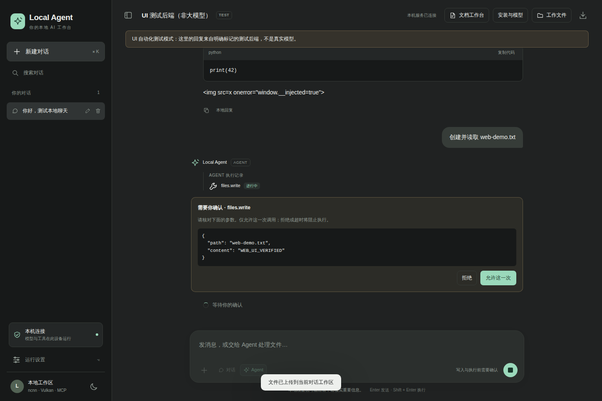</a><br>
<sub>界面展示真实确认流程；本截图中的模型动作由测试替身提出。</sub>
</td>
<td valign="top">
<strong>04 / 下载与安装进度</strong><br>
<a href="docs/images/model-center-download.png">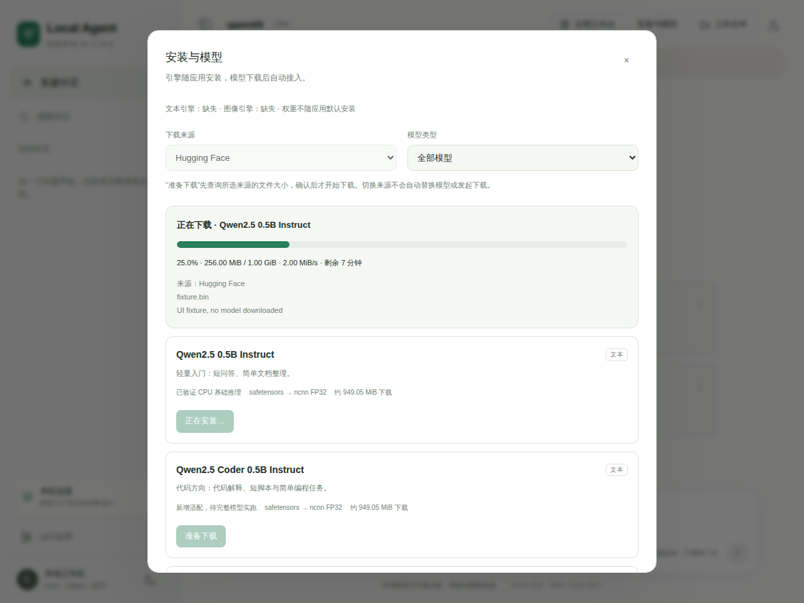</a><br>
<sub>区分下载、校验、转换与启用。示例速度和进度为测试值，不是带宽测评。</sub>
</td>
</tr>
</table>

<details>
<summary><strong>展开查看：对话、代码块与文件工作区</strong></summary>

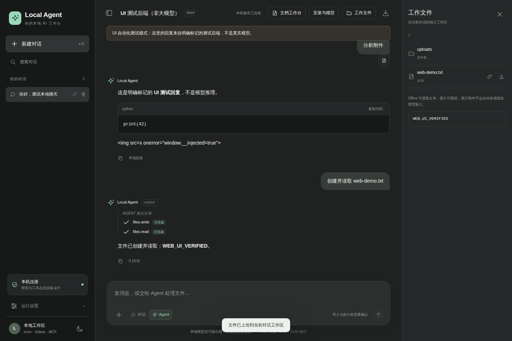

截图中的工作区读写为实际文件操作，模型回复为测试替身；其中作为文本显示的 HTML 是注入防护测试样本，没有被执行。

</details>

### 看清程序正在做什么

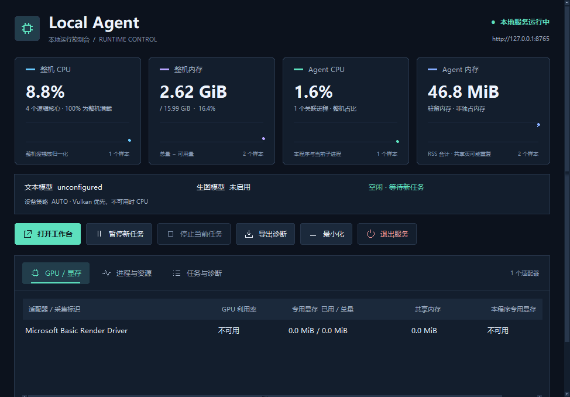

<p align="center"><sub>Windows 打包程序实拍，数值来自该次测试机的实际系统采样；当时未加载模型，不代表模型推理的资源占用。</sub></p>

原生管理窗口独立于浏览器页面。**整机与应用占用分开显示，未知指标明确标为不可用**；GPU 计数器能读到哪些信息，取决于操作系统和驱动。

<details>
<summary><strong>展开查看：GPU / 显存与进程明细</strong></summary>

<table>
<tr>
<td width="50%" valign="top"><strong>GPU / 显存</strong><br><a href="docs/images/monitor-gpu.png">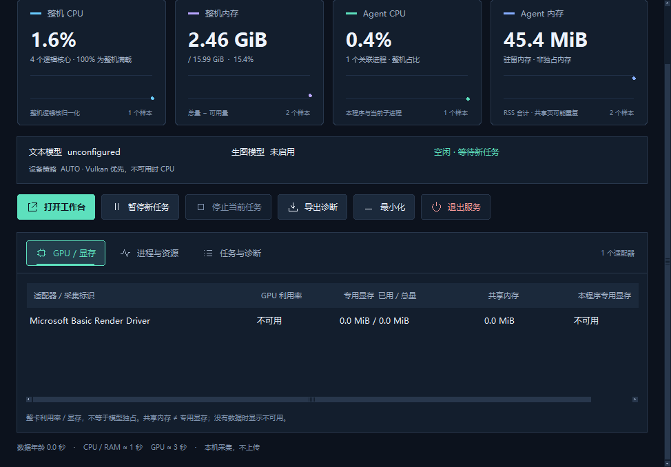</a></td>
<td width="50%" valign="top"><strong>进程与资源</strong><br><a href="docs/images/monitor-processes.png">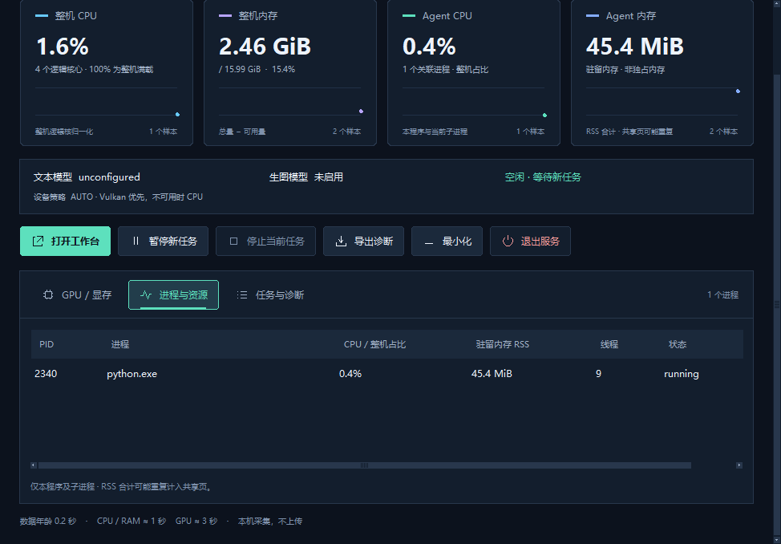</a></td>
</tr>
</table>

这些是 Windows 原生窗口布局验收中的实拍，不是物理 GPU 推理性能测试。参见[监控说明](docs/MONITOR.md)与[界面布局说明](docs/MONITOR_UI.md)。

</details>

<sub>全部图片随仓库保存，可点击查看原图；没有外部图床或临时下载链接。截图来源、运行编号与原文件校验值见[图片说明](docs/images/README.md)和[来源清单](docs/images/PROVENANCE.json)。</sub>

<a id="quick-start"></a>

## 选择模型，也可以直接生图

> 新增 **[Qwen Image 2.1 Turbo](docs/QWEN_IMAGE_TURBO.md)**：固定 8 步，按需下载增量权重并复用基础组件。Hugging Face 支持显式选择 **[HF-Mirror 下载线路](docs/HF_MIRROR.md)**；两条线路按相同可信清单校验。

模型中心支持分类和搜索，原有 ModelScope / Hugging Face 之外新增 **ncnn 上游镜像（SDU）**，按需安装 Qwen3、MiniCPM4、YoutuLLM 等原生模型及 INT8 版本。文字模型与图像模型独立选择；视觉、语音、嵌入等专用接口的接入范围不会冒充聊天能力。

在 **对话 / Agent** 中直接说“帮我画一只猫”或“Draw a cat”，程序会识别明确的绘图请求，展示参数供你确认，再调用当前已启用的 Qwen Image（包括 Turbo），并把实际图片返回消息。无需文字模型先猜测工具动作，也无需切换模式。只问画法、写提示词/文案、否定或引用绘图指令不会触发这条自动路径。

紧接一张成功生成的图片说“把背景改成蓝色”，会将那张已验证的图片作为参考，仍需再次确认。复杂、多步骤或不明确的请求保留原模式；可用 **生图** 或 `/image 画面描述` 明确指定。自动路由是宿主规则，不冒充文字模型推理；不会自动安装模型或绕过权限。

Hugging Face 来源可选择 **原站 / HF-Mirror 第三方镜像**，模型版本与文件校验保持一致；镜像可能重定向到原站或 CDN，不保证加速。见 [下载线路说明](docs/HF_MIRROR.md)。

详见 [多模型与生图调用](docs/MODELS_AND_IMAGES.md)，包括来源、模板、INT8 的 CPU 限制和真实模型测试边界。

## 快速开始

### 使用安装版

打开 [Application installers](https://github.com/chentyjpm/ncnn_llm-agent-demo/actions/workflows/installers.yml)，选择**对应平台任务已通过**的构建产物。安装后启动 Local Agent，在“安装与模型”中选择来源与文字模型，完成安装即可开始使用。模型不随默认安装包一起下载，生图模型是可选项。

更新时先退出旧的本地服务，再覆盖安装；仅刷新浏览器不会更新桌面程序。完整步骤见[安装与升级](docs/INSTALLATION.md)。

### 从源码打开 H5

```bash
git clone https://github.com/chentyjpm/ncnn_llm-agent-demo.git
cd ncnn_llm-agent-demo
python -m pip install -r requirements-office.txt
python -m local_agent serve --open
```

上面会打开本机 H5，不创建原生监控窗口。没有配置模型也能查看界面和使用文档入口；**实际推理仍需要匹配的引擎与权重**。已有本机配置时：

```bash
python -m local_agent serve --config configs/local.json --open
```

桌面入口、内置引擎与打包方法见[安装说明](docs/INSTALLATION.md)和[原生接入](docs/NATIVE_SETUP.md)。

<a id="visual-guide"></a>

## 三张图，看懂项目如何组合

**先分清角色，再看一次任务怎么执行，最后看模型如何准备和选择设备。** 下列图解为可缩放 SVG，点击可查看原图；它们解释运行结构，不代表模型能力或性能已经验收。

### 01 / 模块分工

<a href="docs/images/guide-modules.svg">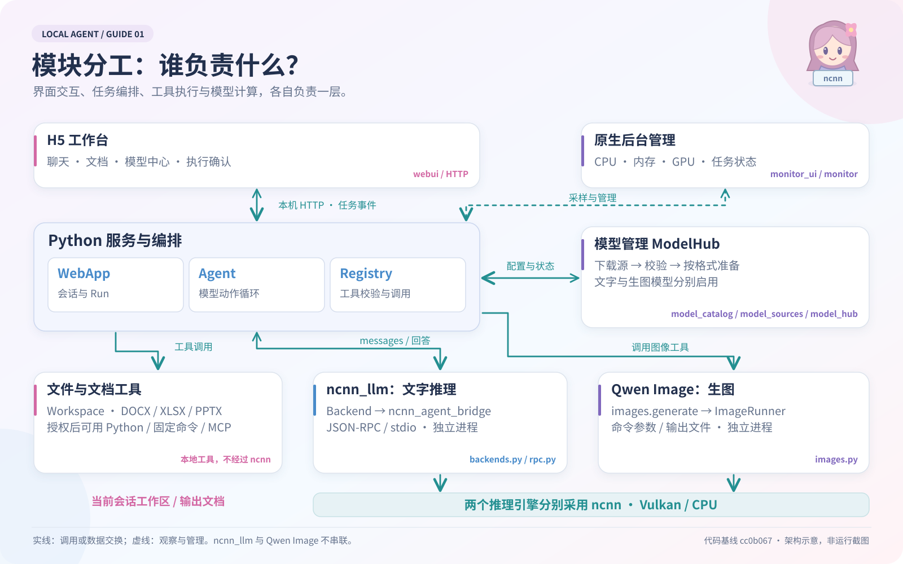</a>

**ncnn_llm 和 Qwen Image 不是前后串联。** 它们分别负责文字和图像推理，底层各自采用 ncnn；Python 的 WebApp、Agent 和 Registry 管理会话、动作与工具。

<details>
<summary><strong>02 / 展开三种模式的完整工作流程</strong></summary>

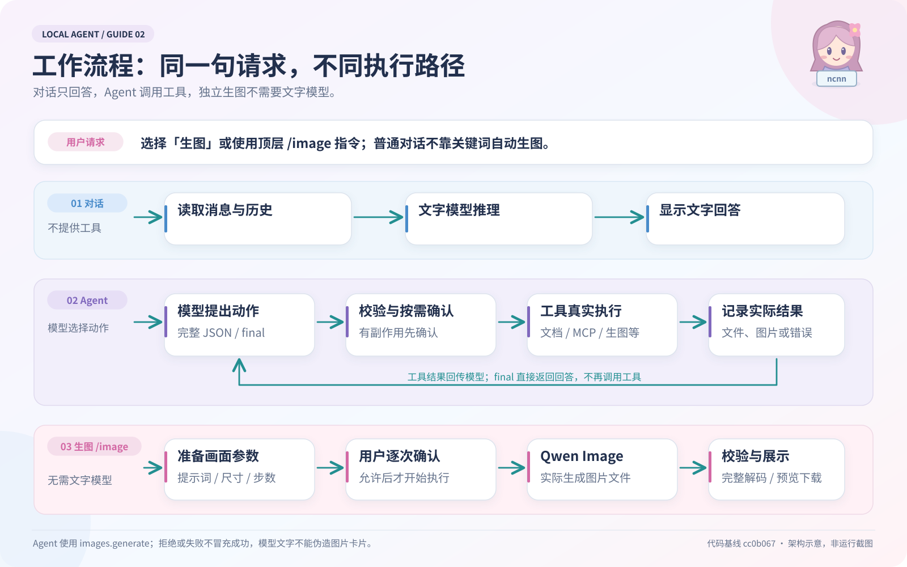

明确的顶层自然语言绘图请求会先转入受确认控制的 Qwen Image 路径；其余普通对话不提供工具。其余 Agent 请求仍由文字模型提出合法动作，`final` 则直接结束并回答。独立生图和顶层 `/image` 指令保持可用；所有生图调用均需确认。

</details>

<details>
<summary><strong>03 / 展开模型安装与 Vulkan / CPU 选择流程</strong></summary>

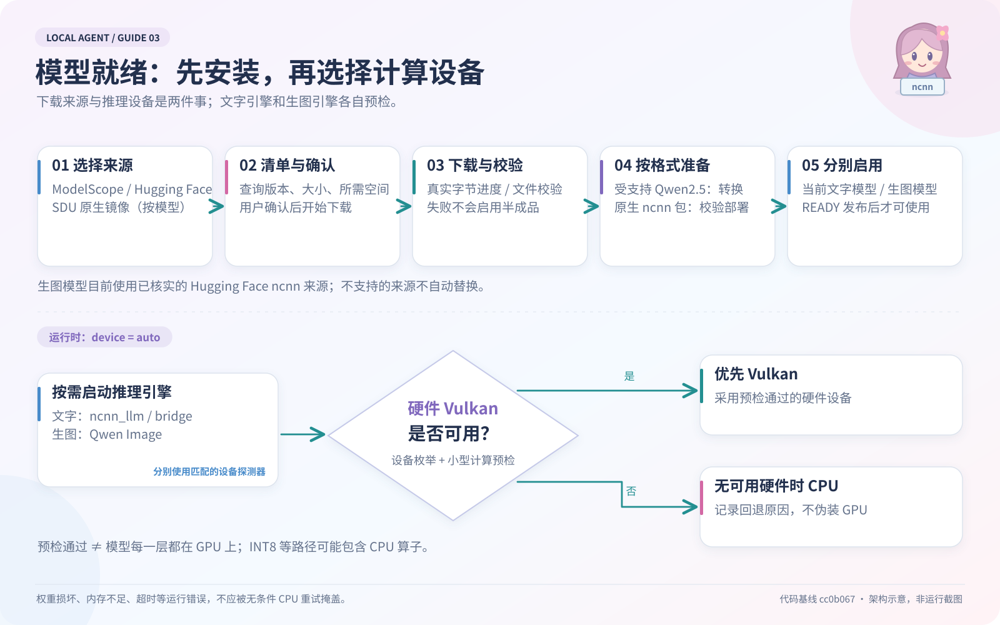

来源按模型匹配，不暗中切换。受支持的官方 Qwen2.5 权重经转换使用，已转换的原生 ncnn 包直接校验部署；不是任意模型都能通用转换。默认 `device: auto` 在两个引擎中分别预检，硬件 Vulkan 不可用才选择 CPU；运行时报错不靠无条件 CPU 重试掩盖。

</details>

[阅读图解说明与代码入口](docs/VISUAL_GUIDE.md) · [查看可编辑 SVG 的生成脚本](docs/render_project_guides.py) · [完整架构文档](docs/ARCHITECTURE.md)

<a id="architecture"></a>

## 引擎怎样变成 Agent

项目不重新训练模型，而是把两个独立推理引擎接到同一套工作流里。

| 组件 | 职责 | 接入方式 |
|---|---|---|
| [ncnn_llm](https://github.com/futz12/ncnn_llm) | 文本模型加载、预填充、生成 | `NcnnBridgeBackend → ncnn_agent_bridge`，JSON-RPC / stdio |
| [qwenimage-ncnn-vulkan](https://github.com/nihui/qwenimage-ncnn-vulkan) | 图像生成与编辑 | `ImageRunner → 独立可执行程序`，命令参数 / 输出文件 |
| **Local Agent** | H5、会话、Agent、文档、MCP、模型安装与监控 | Python 统一装配，原生引擎按需启动 |

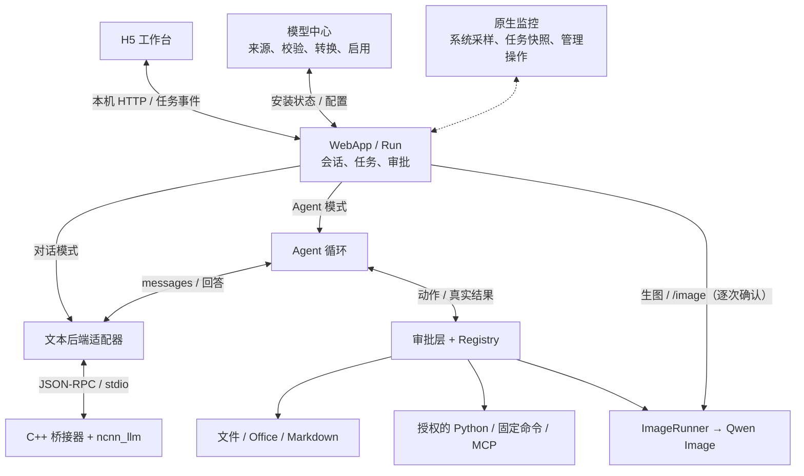

**文本桥接器的 JSON-RPC 是推理协议，不是 MCP。** C++ 引擎只生成文本；工具调用的解析、确认、执行和结果反馈留在 Python。未被识别为明确绘图请求的普通对话不进入工具循环，手动文档导出也不必调用模型。

### 项目结构

```text
local_agent/
├── desktop.py                 桌面入口：内置资源、单实例、自动配置
├── cli.py                     源码入口与 make_runtime() 装配
├── web.py                     会话、Run、HTTP API、审批、取消
├── webui/                     原生 HTML / CSS / JS，无前端构建步骤
│   ├── app.js                 聊天、文件与任务事件
│   └── workbench.js           文档工作台、模型中心与设备信息
├── agent.py                   模型 → 动作 → 工具反馈的循环
├── backends.py + rpc.py        文本引擎适配与 stdio 通信
├── tools.py + paths.py         工具注册、参数校验与独立工作区
├── documents.py               DOCX / XLSX / PPTX / MD 读取与生成
├── execution.py + mcp.py       Python、固定命令与外部 MCP
├── images.py + device.py       生图调用与两套引擎各自的设备选择
├── model_catalog.py           支持的模型、结构和来源
├── model_sources.py           ModelScope / Hugging Face 适配
├── model_hub.py                下载、校验、转换、启用
├── monitor.py + gpu_stats.py   CPU / 内存 / GPU 与任务状态采样
└── monitor_ui.py + monitor_widgets.py + monitor_http.py
                               原生窗口、视觉组件与管理接口
native/                        C++ 桥接器、Vulkan 探测器、图像构建包装
packaging/                     桌面启动与各平台安装脚本
scripts/ + tests/              构建、模型转换与分层验收
.github/workflows/             跨平台工具、引擎、模型、界面及安装 CI
docs/                         架构与专题文档；images/ 保存真实截图
```

### 模块之间的装配点

| 链路 | 谁组合谁 | 结果 |
|---|---|---|
| **启动** | `desktop.main → ModelHub → automatic_config → ManagedWebApp` | 把内置引擎、当前模型和设备策略装成配置 |
| **交互** | `H5 → WebApp.submit → Run → _work` | 创建任务、选取历史、发出事件并保存结果 |
| **推理** | `Agent / 对话 → Backend.complete → StdioRPC → C++` | 返回模型本轮文本；Agent 再解析动作 |
| **执行** | `make_runtime → Registry`；H5 外包 `ConfirmedRegistry` | 配置决定可用工具，单次确认决定是否放行 |
| **文档** | `Agent 工具 / 手动 HTTP API → DocumentTools` | 同一套读写能力，同时服务模型和用户 |
| **安装** | `Catalog → Sources → ModelHub → on_change` | 下载源文件变为已启用的本地模型目录 |
| **监控** | `ResourceSampler + runtime_snapshot → MonitorService → Dashboard` | 观察进程和任务，不参与推理决策 |

完整目录、对象职责、接口和扩展入口见 **[架构与模块组合](docs/ARCHITECTURE.md)**。

### 一条任务怎样走完

以“读取 Word，将摘要另存为 Markdown”为例：

```text
用户上传文件 → WebApp 创建任务 → Agent 把任务和工具定义交给模型
    → 模型提出 documents.read → 工具读取正文 → 真实结果回给模型
    → 模型提出 documents.create → 用户确认 → 工具写出新文件
    → 模型输出 final → 会话保存结果，文件面板显示产物
```

模型请求一次只允许一个完整动作，例如：

```json
{"tool":"documents.read","arguments":{"path":"uploads/example.docx","offset":0,"limit":12000}}
```

`parse_action()` 校验动作，`Registry.call()` 执行已注册工具，工具结果进入下一轮上下文。格式重试、重复调用、轮数和上下文都有上限。**模型说“完成”不等于文件已生成，验收要检查实际工具结果和文件。**

<details>
<summary><strong>进程生命周期与数据目录</strong></summary>

原生窗口、HTTP 服务、任务线程、模型安装和监控采样属于同一个应用进程；文本引擎、图像引擎和外部 MCP 等按需作为子进程启动。Windows 子进程使用静默启动，输出仍进入日志管道。

文本桥接器在同一任务的多轮调用间复用权重，任务结束释放；不同网页消息目前仍可能重新加载模型。生图前先释放文本后端，后续总结时再加载。当前只接受一个聊天 / Agent 任务。

```text
用户数据根目录/
├── models/                    下载缓存与已安装权重
├── models.json                当前启用模型
├── model-job.json             最近安装状态
├── state/sessions/            会话与最终消息
├── state/runs/                原始任务审计
└── workspace/web/<会话 ID>/    独立文件工作区
    ├── uploads/
    └── exports/
```

程序和用户数据分开存放。取消任务不回滚已执行操作，服务重启不自动重放工具调用。详情见[生命周期与数据](docs/ARCHITECTURE.md#5-进程生命周期与数据存放)。

</details>

## 模型与能力边界

模型中心保留 **Qwen2.5 0.5B、Coder 0.5B、1.5B** 的 ModelScope / Hugging Face 来源，并列入 Qwen3、MiniCPM4、YoutuLLM 等上游原生 ncnn 包与 INT8 版本。**列入目录不等于全部模型已通过推理或质量验收**。Qwen Image 2.1 为可选项，目前仅接入已匹配的 Hugging Face ncnn 来源。详见[模型中心](docs/MODEL_CENTER.md)与[多模型说明](docs/MODELS_AND_IMAGES.md)。

默认 `device: "auto"` 会按引擎分别预检，优先可用的硬件 Vulkan，否则选择 CPU 并记录原因；**不是所有推理异常都自动用 CPU 重试**。图像引擎接通和启动检查通过，也不代表完整生图、画质或各显卡性能已验证。

文档工具提供正文 / 表格提取和新文件导出，不是完整 Office 编辑器：不保留任意复杂版式，不重算 Excel 公式，不执行宏。Python、固定命令和外部 MCP 默认关闭，明确授权后才注册。本机单用户与工作区检查不等于操作系统沙箱；模型下载和授权的外部工具仍可能联网。

当前没有内置 Agent 专用浏览器、通用联网搜索、OCR / VLM 或 RAG；也不是逐 token 流式输出。支持范围与权限见[文档工具](docs/DOCUMENTS.md)、[H5 API](docs/WEB_UI.md)及[安全说明](docs/SECURITY.md)。

## 测试与验证

顶部徽章直接读取 GitHub Actions 状态，不是写死的“全部通过”。不同层的测试回答不同问题：

| 验证层 | 检查内容 | 入口 |
|---|---|---|
| 工具 / HTTP | 文件、文档、协议、审批和任务状态 | [工具测试](https://github.com/chentyjpm/ncnn_llm-agent-demo/actions/workflows/ci.yml) |
| 原生引擎 | 编译、链接、CLI、设备预检和归档复测 | [原生构建](https://github.com/chentyjpm/ncnn_llm-agent-demo/actions/workflows/native-build.yml) |
| 真实模型 | 固定权重、数值比对、CPU 推理和小型工具流程 | [Qwen CPU](https://github.com/chentyjpm/ncnn_llm-agent-demo/actions/workflows/qwen05-cpu.yml) |
| H5 界面 | 实际 Chromium 交互；模型部分为标记的测试替身 | [浏览器验收](https://github.com/chentyjpm/ncnn_llm-agent-demo/actions/workflows/web-ui.yml) |
| 原生监控 | 实际窗口、系统采样、缩放、键盘和无控制台子进程 | [监控验收](https://github.com/chentyjpm/ncnn_llm-agent-demo/actions/workflows/native-monitor.yml) |
| 安装应用 | 打包程序、安装后运行、HTTP / 文档与窗口检查 | [安装验收](https://github.com/chentyjpm/ncnn_llm-agent-demo/actions/workflows/installers.yml) |

截图基线 `b611f8d` 的 Windows 安装任务已通过，Intel Mac 安装任务仍有 Vulkan 探测故障；不要把某一平台通过当成全平台通过。该次记录见[安装流水线](https://github.com/chentyjpm/ncnn_llm-agent-demo/actions/runs/36688044006)，后续状态以各提交的实际结果为准。

本地回归：

```bash
python -m pip install -r requirements-office.txt -r requirements-monitor.txt
python scripts/run_tests.py --output-dir reports/ci/tools
```

## 文档导航

| 理解项目 | 使用与配置 | 验证与排错 |
|---|---|---|
| [图解项目](docs/VISUAL_GUIDE.md) | [多模型与生图入口](docs/MODELS_AND_IMAGES.md) | [0.8B 验收策略](docs/NATIVE_MODEL_ACCEPTANCE.md) |
| [架构与模块组合](docs/ARCHITECTURE.md) | [安装与升级](docs/INSTALLATION.md) | [CI 说明](docs/CI.md) |
| [H5 API 与任务](docs/WEB_UI.md) | [模型中心与下载源](docs/MODEL_CENTER.md) | [真实 Qwen CPU](docs/QWEN05_CPU.md) |
| [文档处理模块](docs/DOCUMENTS.md) | [Vulkan 与 CPU](docs/VULKAN.md) | [监控采样](docs/MONITOR.md) |
| [原生引擎接入](docs/NATIVE_SETUP.md) | [权限与安全边界](docs/SECURITY.md) | [原生窗口布局](docs/MONITOR_UI.md) |

---

<div align="center">
<p><strong>基于开源引擎，组合你自己的本地工作流。</strong></p>
<p><a href="https://github.com/futz12/ncnn_llm">ncnn_llm</a> · <a href="https://github.com/nihui/qwenimage-ncnn-vulkan">Qwen Image ncnn</a> · <a href="LICENSE">MIT License</a> · <a href="THIRD_PARTY.md">第三方声明</a></p>
</div>
