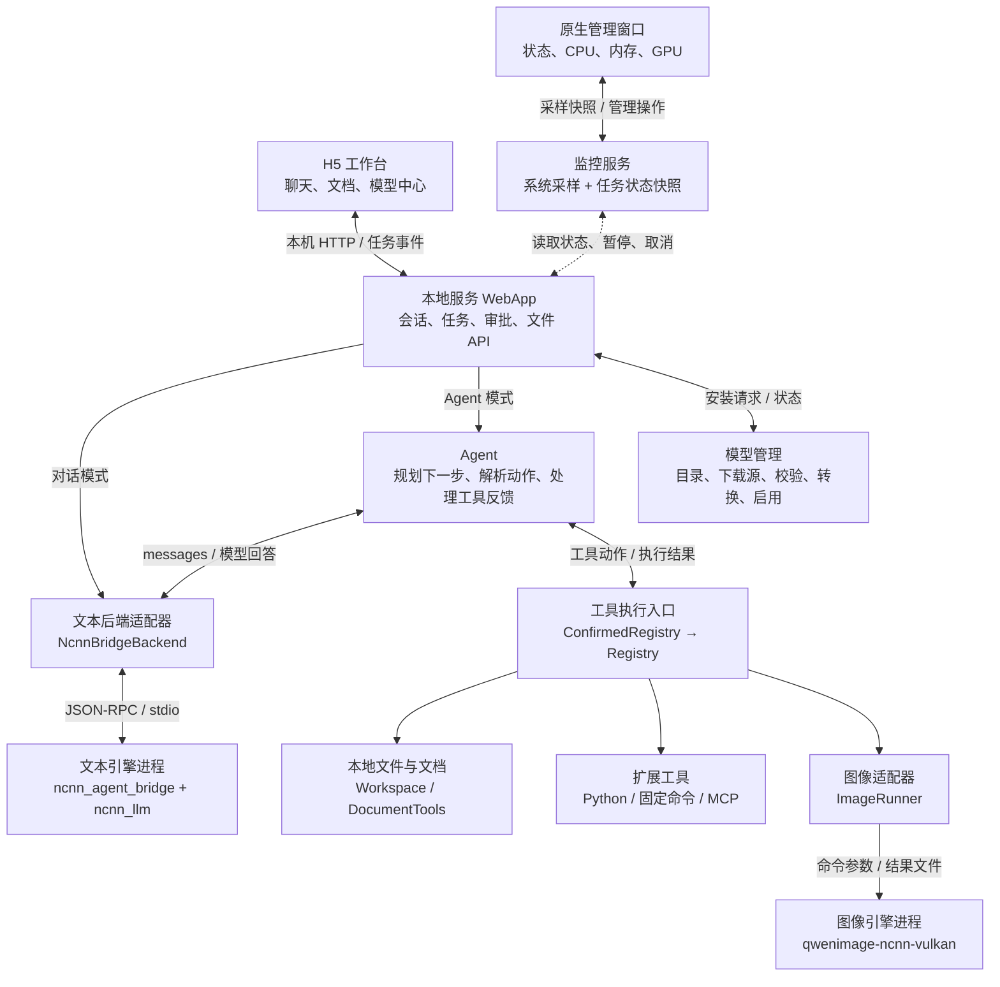
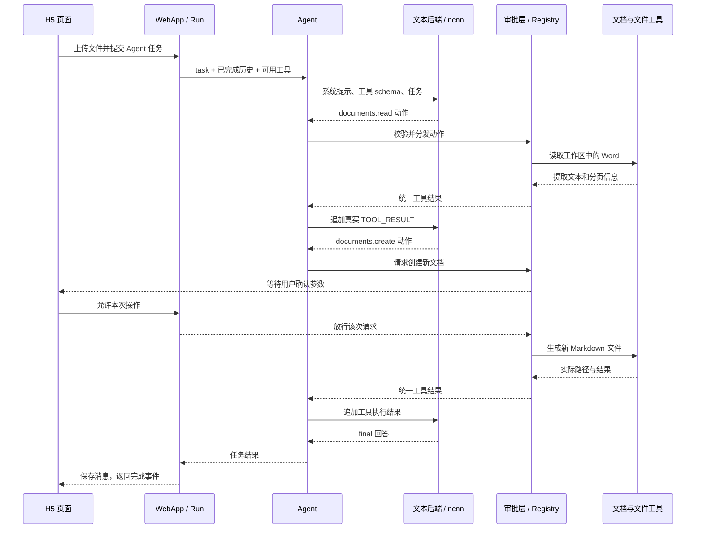

# Local Agent

**基于 ncnn 的本地 AI 工作流与文档工作台。** 项目将文本推理、图像生成、文件与 Office 工具组合成一个桌面应用：H5 页面负责交互，Python 负责调度，C++ 引擎负责模型计算，独立的原生管理窗口负责观察资源和管理任务。

本仓库的核心不是训练模型，而是把模型变成可以调用工具、处理文件、生成文档的本地 Agent。

[总体架构](#1-总体架构) · [目录结构](#2-目录结构) · [模块组合](#3-模块如何组合) · [任务流程](#4-一条-agent-任务如何执行) · [运行与数据](#5-进程生命周期与数据存放) · [开发入口](#6-从哪里阅读和扩展代码) · [启动与文档](#7-启动构建与详细文档)

## 1. 总体架构

项目由三个主体组合而成：

| 主体 | 提供的能力 | 在本项目中的接入方式 |
|---|---|---|
| [ncnn_llm](https://github.com/futz12/ncnn_llm) | 文本模型加载与推理 | 编译进 `ncnn_agent_bridge`，通过标准输入输出接收推理请求 |
| [qwenimage-ncnn-vulkan](https://github.com/nihui/qwenimage-ncnn-vulkan) | 图像生成与编辑 | 保留独立可执行程序，由 `ImageRunner` 传入参数并取得输出文件 |
| **本仓库** | 界面、会话、Agent、工具、模型安装、设备选择、监控与打包 | 将两个引擎和业务工具组合成一个应用 |

**两个上游没有被强行合并为一个推理库。** 它们分别构建、分别运行，Python 在进程边界上连接它们，避免相互绑定不同版本的 ncnn 依赖。



图中的分工可以归纳为：**界面发起请求，服务组织任务，模型提出动作，工具执行动作，监控观察运行。** 普通对话不经过工具循环；文档工作台中的直接导出也不需要先调用模型。

## 2. 目录结构

下面列出运行主线涉及的目录和文件；测试脚本与构建细节放在对应目录中。

```text
ncnn_llm-agent-demo/
├── local_agent/                 Python 应用与编排层
│   ├── __main__.py              python -m local_agent 入口
│   ├── cli.py                   命令行、配置读取、make_runtime() 装配
│   ├── desktop.py               桌面启动器、单实例、自动配置、服务生命周期
│   ├── web.py                   WebApp、会话、Run、HTTP 路由、审批与取消
│   ├── webui/                   H5 静态资源，无需前端构建
│   │   ├── index.html           页面结构
│   │   ├── style.css            布局与主题
│   │   ├── app.js               聊天、文件、任务事件与消息渲染
│   │   └── workbench.js         文档工作台、模型中心与设备信息
│   ├── agent.py                 Agent 循环、动作解析、提示词与审计
│   ├── backends.py              文本推理后端：常驻桥接器 / 上游 CLI
│   ├── tools.py                 Tool、Registry、参数 schema 校验
│   ├── paths.py                 Workspace：路径约束、读写、精确替换
│   ├── documents.py             Word / Excel / PPT / Markdown 读取与生成
│   ├── execution.py             PythonRunner、CommandRunner
│   ├── images.py                ImageRunner：图像引擎调用
│   ├── rpc.py                   stdio JSON-RPC 通信
│   ├── mcp.py                   MCP 工具发现、调用和连接生命周期
│   ├── process.py               子进程、管道、超时与 Windows 静默启动
│   ├── device.py                两个引擎各自的 Vulkan / CPU 选择
│   ├── model_catalog.py         模型白名单、结构参数、来源与版本
│   ├── model_sources.py         ModelScope / Hugging Face 文件清单与下载
│   ├── model_hub.py             下载任务、进度、校验、转换、模型启用
│   ├── monitor.py               系统/应用资源采样和任务状态快照
│   ├── gpu_stats.py             各平台 GPU / 显存采集
│   ├── monitor_ui.py            Tk 原生管理窗口
│   └── monitor_http.py          桌面服务扩展与监控 HTTP 接口
├── native/                      C++ 推理接入层
│   ├── CMakeLists.txt           文本引擎、桥接器与探测程序的构建入口
│   ├── ncnn_agent_bridge.cpp    infer / ping 协议，调用 ncnn_llm
│   ├── device_probe.cpp         与各引擎匹配的 Vulkan 计算预检
│   └── image/CMakeLists.txt     图像引擎及其探测程序的构建包装
├── packaging/                   桌面分发入口与各系统安装脚本
│   └── launch.py                安装程序启动入口
├── scripts/                     构建、模型转换、浏览器与安装验收脚本
├── tests/                       Python 单元与集成测试
├── model-tests/native/          真实模型数值对照测试
├── configs/                     源码运行的配置示例
├── examples/                    示例 MCP 服务与演示任务
├── ci/dependencies.json         原生依赖版本锁定
├── upstream-lock.json           上游项目版本锁定
├── .github/workflows/           构建、测试与安装包流水线
└── docs/                        安装、接口、模型、文档、监控等专题说明
```

## 3. 模块如何组合

### 3.1 启动层：把资源和服务装配起来

项目有两套入口，共用业务模块，但负责的启动工作不同。

| 入口 | 调用关系 | 使用场景 |
|---|---|---|
| 桌面安装版 | `packaging/launch.py → desktop.main()` | 自动定位内置引擎和用户目录，创建模型管理器、本地服务、原生监控窗口 |
| 源码命令行 | `__main__.py → cli.main()` | 读取配置，提供 `serve`、`run`、`doctor`、`tools` 等命令 |

[desktop.py](local_agent/desktop.py) 先创建 `ModelHub`，再由 `automatic_config()` 将**内置引擎路径 + 当前启用模型 + 默认设备策略**组装成运行配置。桌面使用 `ManagedWebApp` / `ManagedServer`，它们在普通 Web 服务上增加暂停接收任务和监控接口。

模型安装或启用发生变化时，`ModelHub.on_change` 通知启动器刷新配置，后续任务读取新配置。安装版不要求用户手写引擎路径；源码模式则通过 [cli.py](local_agent/cli.py) 读取 `configs/local.json`。普通 `serve` 不创建原生监控窗口。

### 3.2 服务层：连接页面、会话和执行线程

[web.py](local_agent/web.py) 中的三个对象分别管理不同范围：

| 对象 | 管什么 | 与其他模块的关系 |
|---|---|---|
| `Sessions` | 会话标题、用户消息、回答与历史记录 | 从磁盘加载并保存会话 JSON |
| `Run` | 一次任务的状态、事件、取消标志和待确认操作 | 被工作线程更新，被页面查询，被监控读取 |
| `WebApp` | 请求校验、附件处理、历史选取、任务创建与收尾 | 调用文本后端、Agent、文档工具和模型管理器 |

页面提交消息后，`WebApp.submit()` 创建 `Run` 并启动 `_work()` 工作线程。`_work()` 根据模式分流：对话模式直接调用后端；Agent 模式调用 `make_runtime()`，把工作区、工具注册表和 MCP 客户端装配好，再启动 `Agent.run()`。

执行期间，`LiveAudit` 把模型开始、工具调用、审批和结果转成任务事件，同时保留审计日志。H5 通过**带游标的 HTTP 长轮询**读取事件；当前不是逐 token 流式输出。

### 3.3 推理层：文本后端与图像后端各走一条通道

**文本通道：** [backends.py](local_agent/backends.py) 的 `NcnnBridgeBackend.complete(messages)` 通过 `rpc.py` 向 C++ 进程发送 `infer`。桥接器负责消息模板、模型预填充和生成，返回 `result.text`。模型输出是普通文本还是 JSON 动作，由调用方的任务提示决定。

```text
Python messages
  → StdioRPC.request("infer", {messages, max_new_tokens})
  → ncnn_agent_bridge.cpp
  → ncnn_llm 的 prefill / generate
  → {"text": "模型输出"}
  → 普通对话显示文本，或 Agent 解析动作
```

文本桥接器的 JSON-RPC 是本项目的**推理协议，不是 MCP**。C++ 不执行文件、Shell 或文档工具。另有 `NcnnCLIBackend` 兼容上游交互式 `llm_ncnn_run`，通过启动进程并解析其输出来取得回答。

**图像通道：** [images.py](local_agent/images.py) 的 `ImageRunner` 将提示词、尺寸、步数、参考图和输出路径转换为命令参数，启动独立图像进程，再检查退出状态和输出文件。它不通过文本桥接器执行。

两条通道都调用 [device.py](local_agent/device.py) 选择设备。默认 `device: "auto"`：使用各引擎匹配的 `ncnn_device_probe` 做预检，可用时优先硬件 Vulkan，不可用时选择 CPU 并记录原因。设备预检不是完整模型验收；普通权重错误或内存不足不会被无条件 CPU 重试掩盖。

### 3.4 工具层：把模型动作映射到实际操作

[tools.py](local_agent/tools.py) 的 `Registry` 是统一工具入口。每个 `Tool` 包含**名称、说明、参数 schema、执行函数**。`Registry.schemas()` 把可用工具描述交给模型；`Registry.call()` 检查工具与参数，并返回统一的成功或错误结果。

| 工具名称 | 实现模块 | 实际执行位置 |
|---|---|---|
| `files.list/read/write/patch` | `paths.py → Workspace` | Python 主程序内，操作当前工作区 |
| `documents.read/create` | `documents.py → DocumentTools` | Python 主程序内，调用 Office 文档库 |
| `python.run` | `execution.py → PythonRunner` | 配置指定的 Python 子进程或 Docker 容器 |
| `system.run` | `execution.py → CommandRunner` | 管理员预先定义的固定 argv 子进程 |
| `images.generate` | `images.py → ImageRunner` | 独立 Qwen Image 引擎进程 |
| `mcp__<服务名>__<工具名>` | `mcp.py → MCPClient` | 已授权的外部 MCP Server 进程 |

H5 在 Registry 外包了一层 `ConfirmedRegistry`：文件/文档读取直接执行，有副作用的操作先等待用户逐次确认。**启动配置决定有没有这项能力，网页确认决定本次调用是否放行。** 两者不是同一个权限开关。

MCP 的组合方式是 `MCPClient → initialize → tools/list → 白名单筛选 → Registry`；实际调用再走 `tools/call`。模型不处理 MCP 协议，也不能通过模型生成的名称调用未注册工具。当前实现是 stdio tools 子集。

### 3.5 文档层：同一套能力服务两种入口

[documents.py](local_agent/documents.py) 使用 `python-docx`、`openpyxl`、`python-pptx` 处理正文和表格，以文本/基础 Markdown 连接模型与文档格式。

```text
Agent 模式：模型 → documents.read/create → DocumentTools → 工作区文件
手动工作台：用户编辑草稿 → 文档 HTTP API → DocumentTools → 工作区文件
```

因此，读取 Word、整理 Excel、生成 PPT 不必先让模型编写并执行 Python。模型负责理解和组织内容，专用工具负责文件格式；用户在文档工作台直接导出时，甚至不需要调用模型。

这层提供正文提取和新文档生成，不是 Office 在线编辑器：不保留任意复杂原始版式，不重算 Excel 公式，不执行宏。具体支持范围见 [文档工具](docs/DOCUMENTS.md)。

### 3.6 模型管理层：把下载文件变成可用的模型目录

这部分与 Agent 的任务执行分开，负责模型进入应用之前的准备工作。

| 模块 | 职责 |
|---|---|
| `model_catalog.py` | 定义支持哪些模型、各自结构参数、下载源和固定版本 |
| `model_sources.py` | 适配 ModelScope / Hugging Face 的文件清单、下载地址和校验信息 |
| `model_hub.py` | 管理确认、下载进度、缓存、校验、转换和最终启用 |
| `scripts/qwen05_export.py` | 将已适配文本模型的官方权重转换为 ncnn 图、权重和分词器文件 |
| `desktop.py` | 将启用结果转换成后端的 `command`、`model` 等配置 |

安装链路为 **选择模型和来源 → 获取文件清单 → 用户确认 → 下载 → 校验 → 必要时转换 → 发布 READY 清单 → 启用并刷新配置**。推理阶段直接读取本地模型目录，不需要每次访问下载源。

新增一个模型不仅是给界面加名字，还要适配结构、转换方法和实际推理。当前模型及来源范围见 [模型中心](docs/MODEL_CENTER.md)。

### 3.7 监控层：观察服务，不参与模型计算

[monitor_ui.py](local_agent/monitor_ui.py) 绘制独立 Tk 窗口；[monitor.py](local_agent/monitor.py) 的 `MonitorService` 在采样线程中组合两类数据：`ResourceSampler` 提供系统和本程序进程树的 CPU/内存，`runtime_snapshot()` 提供 WebApp 的任务、模型和工具阶段。[gpu_stats.py](local_agent/gpu_stats.py) 提供可取得的 GPU/显存信息。

管理窗口通过这套服务暂停接收任务、请求取消和导出诊断，不经模型决定。`monitor_http.py` 补充受 token 保护的状态查询与窗口唤起接口。监控不反复执行 Vulkan 预检，也不改变引擎设备策略；不可读取的指标标为不可用。详见 [后台管理](docs/MONITOR.md)。

## 4. 一条 Agent 任务如何执行

以“读取上传的 Word，把摘要保存成新的 Markdown 文件”为例，以下是调用关系示例，不是预置的固定执行脚本。



[agent.py](local_agent/agent.py) 的循环始终围绕两种动作：

```json
{"tool":"documents.read","arguments":{"path":"uploads/example.docx","offset":0,"limit":12000}}
```

```json
{"final":"摘要已保存，可以在工作文件中查看。"}
```

`parse_action()` 只接受完整、符合协议的对象；格式错误反馈给模型修正。工具结果也作为数据追加到下一轮输入，模型再决定继续调用、处理错误还是结束。为避免无限循环，程序限制轮数、重复动作、格式重试和上下文长度。

任务事件、原始审计和最终结果是三种不同输出：事件让页面知道“正在做什么”；审计记录模型原文及工具结果；最终结果写入会话。**“模型说完成”不能替代对实际文件和工具结果的检查。**

## 5. 进程生命周期与数据存放

### 运行时不是一组互相独立的微服务

```text
LocalAgent 主进程
├── 主线程：Tk 管理窗口
├── HTTP 服务线程及请求线程：页面与 API
├── 任务工作线程：本次对话 / Agent 循环
├── 模型安装线程：下载、校验、转换
├── 资源采样线程：CPU / 内存 / GPU
└── 按需启动的子进程
    ├── ncnn_agent_bridge：文本推理
    ├── qwenimage-ncnn-vulkan：图像推理
    ├── ncnn_device_probe：设备预检
    └── 已授权的 MCP / Python / 固定命令
```

原生窗口与 HTTP 服务属于**同一应用进程、不同线程**；浏览器和原生推理引擎才在独立进程中。当前同时只接受一个聊天/Agent 任务，模型安装进行中也不会开始新推理。

`NcnnBridgeBackend` 在一个任务的多轮调用间复用模型进程和权重，但 C++ 每次 `infer` 重新构造该次请求的上下文。任务结束释放后端，因此不同网页消息之间目前仍会重新加载；并非跨会话永久常驻模型。`NcnnCLIBackend` 则每一轮都启动新进程。生图前 Agent 先释放文本后端，之后需要总结时再加载。

[process.py](local_agent/process.py) 与 [rpc.py](local_agent/rpc.py) 统一管理子进程和输出管道，并在 Windows 使用静默启动选项，避免推理反复弹命令行窗口。取消是合作取消，不回滚已经执行的文件或外部操作。

### 用户数据与程序文件分开

安装版的数据根目录在 Windows 为 `%LOCALAPPDATA%/LocalAgent`，macOS 为 `~/Library/Application Support/LocalAgent`，Linux 为 `$XDG_DATA_HOME/local-agent`（默认 `~/.local/share/local-agent`）。

```text
用户数据根目录/
├── models/                      下载缓存与已安装模型
│   └── <模型 ID>/READY.json      安装完成清单
├── models.json                  当前启用的文本/图像模型
├── model-job.json               最近的模型安装状态
├── state/
│   ├── sessions/<会话 ID>.json   会话与最终消息
│   └── runs/<任务 ID>.jsonl      原始任务审计
└── workspace/web/<会话 ID>/      每段网页会话的独立工作区
    ├── uploads/                 用户上传的文件
    └── exports/                 文档工具生成的新文件
```

文件工具以工作区相对路径读写；模型、会话和审计不放在可公开访问的网页静态目录。服务重启会标记未完成任务为中断，不自动重放工具调用。会话历史会按数量和字符预算选择后发送给模型，不等同于长期记忆或 RAG。

## 6. 从哪里阅读和扩展代码

理解主线建议按 **`desktop.py / cli.py → web.py → agent.py → backends.py / tools.py`** 的顺序阅读，再进入具体工具。这样先看清谁创建谁、谁调用谁，再看实现细节。

| 需要修改的能力 | 主要改动位置 | 需要保持的连接关系 |
|---|---|---|
| 增加工具 | 新工具模块、`tools.py` 或 `cli.make_runtime()` | 实现函数 → 注册 Tool/schema → 审批策略 → 结果反馈 |
| 接入另一文本后端 | `backends.py`、`cli.py`、`web.py` 的后端映射 | 保持 `complete(messages)` 和 `release()` 接口 |
| 增加可选模型 | `model_catalog.py`、`model_sources.py`、转换器 | 来源/校验 → 匹配权重格式 → 原生推理验收 |
| 优化文档处理 | `documents.py`、`web.py`、`workbench.js` | 同一实现同时服务 Agent 工具和手动工作台 |
| 增加监控指标 | `gpu_stats.py` / `monitor.py`、`monitor_ui.py` | 后台采样 → 快照 → 窗口，不阻塞推理和 UI |
| 调整应用分发 | `scripts/package_desktop.py`、`packaging/`、安装流水线 | 两个引擎及依赖 → 完整应用 → 安装后验收 |

新增能力应接入现有装配点，而不是在 H5 按钮中直接拼接系统命令。Python、系统命令、外部 MCP 仍需明确授权；工作区检查和界面确认不等于操作系统沙箱。完整边界见 [安全说明](docs/SECURITY.md)。

## 7. 启动、构建与详细文档

**安装版：** 从成功的 `Application installers` 工作流获取对应系统产物，安装后启动 Local Agent；两个引擎随应用提供，模型在界面中选择来源并按需安装。流程见 [安装说明](docs/INSTALLATION.md)。

**源码 H5：** 在完整仓库根目录运行以下命令。未配置模型时可打开界面；实际推理需要配置匹配的引擎与权重。

```bash
python -m pip install -r requirements-office.txt
python -m local_agent serve --open
# 已准备 configs/local.json 时：
python -m local_agent serve --config configs/local.json --open
```

**桌面入口与构建：** `packaging/launch.py` 调用自动装配启动器；开发环境还需监控依赖和原生引擎资源。安装流水线组合 `ci_native.py` 的原生构建与 `package_desktop.py` 的应用打包，分平台产出程序，不是一个二进制通用所有系统。

**本地回归：**

```bash
python -m pip install -r requirements-office.txt -r requirements-monitor.txt
python scripts/run_tests.py --output-dir reports/ci/tools
```

测试按工具/HTTP、原生引擎、真实模型、H5、原生监控和安装包分层；实际结果查看对应提交的 Actions；各层的通过结论不能相互替代。

| 主题 | 文档 |
|---|---|
| 安装、升级与打包 | [INSTALLATION.md](docs/INSTALLATION.md) |
| 原生引擎接入与构建 | [NATIVE_SETUP.md](docs/NATIVE_SETUP.md) |
| H5 API、会话与任务 | [WEB_UI.md](docs/WEB_UI.md) |
| 文档支持范围 | [DOCUMENTS.md](docs/DOCUMENTS.md) |
| 模型、来源和安装状态 | [MODEL_CENTER.md](docs/MODEL_CENTER.md) |
| Vulkan 选择与 CPU 回退 | [VULKAN.md](docs/VULKAN.md) |
| 原生监控与静默子进程 | [MONITOR.md](docs/MONITOR.md) |
| 权限与执行边界 | [SECURITY.md](docs/SECURITY.md) |
| 持续集成与模型验证 | [CI.md](docs/CI.md) / [QWEN05_CPU.md](docs/QWEN05_CPU.md) |

当前默认服务面向本机单用户，仅监听回环地址。专用联网工具、Agent 独立浏览器、OCR/VLM 和 RAG 不属于现有内置功能；浏览器测试脚本不等于 Agent 已具备浏览器操作能力。

项目许可见 [LICENSE](LICENSE)，依赖与上游说明见 [THIRD_PARTY.md](THIRD_PARTY.md)。
